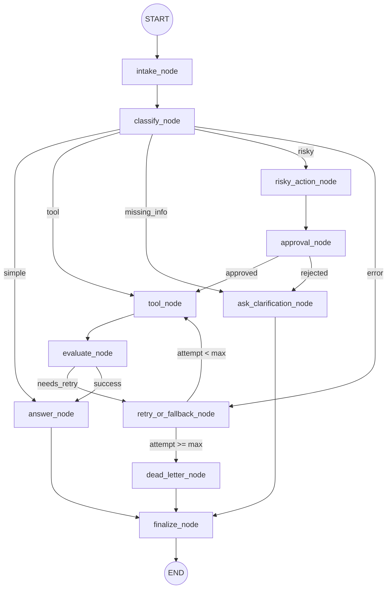

# Graph Diagram

```mermaid
graph TD
    START((START)) --> intake[intake_node]
    intake --> classify[classify_node]
    
    classify -->|simple| answer[answer_node]
    classify -->|tool| tool[tool_node]
    classify -->|missing_info| clarify[ask_clarification_node]
    classify -->|risky| risky_action[risky_action_node]
    classify -->|error| retry[retry_or_fallback_node]
    
    risky_action --> approval[approval_node]
    approval -->|approved| tool
    approval -->|rejected| clarify
    
    retry -->|attempt < max| tool
    retry -->|attempt >= max| dead_letter[dead_letter_node]
    
    tool --> evaluate[evaluate_node]
    evaluate -->|needs_retry| retry
    evaluate -->|success| answer
    
    answer --> finalize[finalize_node]
    clarify --> finalize
    dead_letter --> finalize
    
    finalize --> END((END))
```
